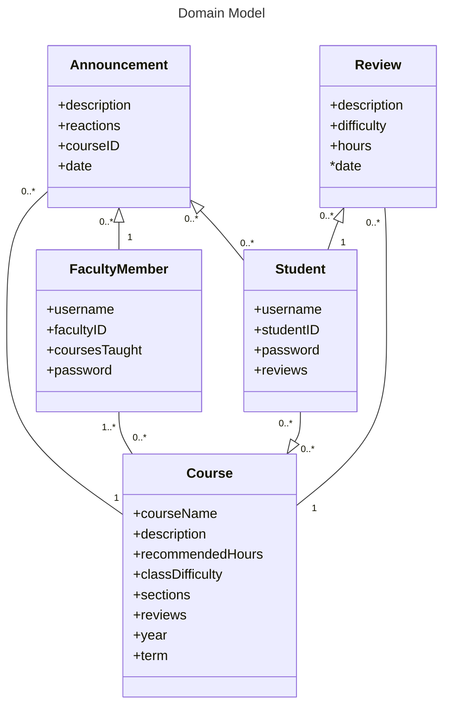
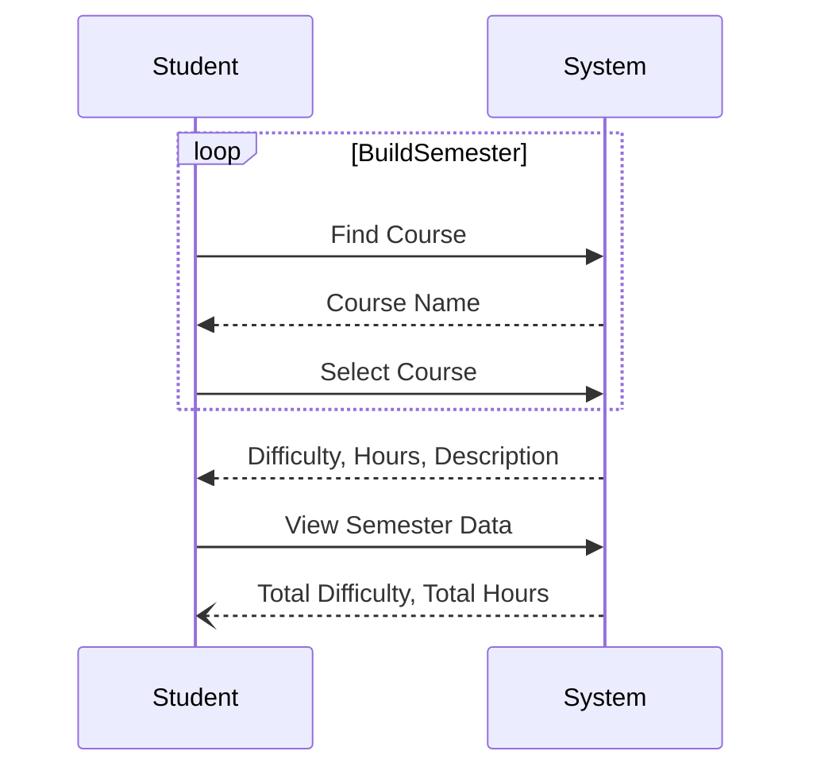
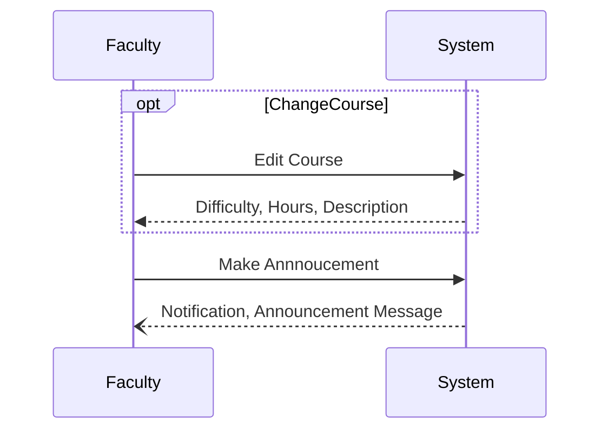
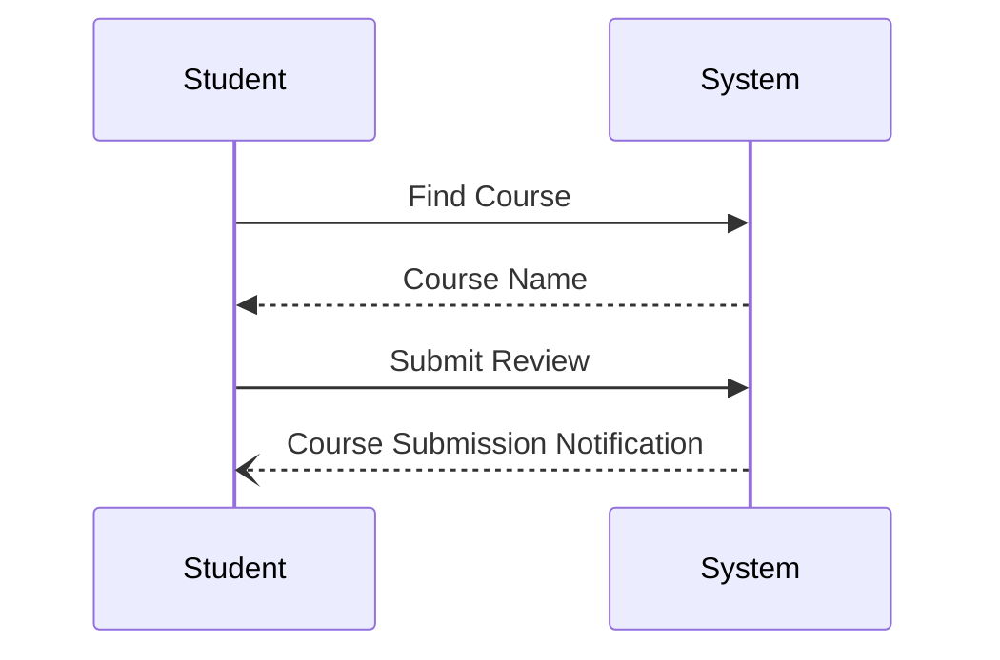

# Team Apache-84: Analysis Models

This document will describe the Analysis phase of the project.

## Document Overview

This document outlines the Analysis Models for Blueprint.VIU.CS system, a course planning tool aimed at improving the experience of students and faculty through course reviewing. The document entails the Data Models and process models as well as updates made to the Project, Project Plan and Requirements.

Within the Data models our core entities are shown in a Domain model diagram that displays how the different objects and users in the system interact with each other. The Process Models include our System Sequence Diagrams which show the interaction of use cases and how the system relays data back to the user.

## Updates

### Project Updates

1. We have decided that the way we will verify student and faculty users will be through creating an ‘account’ with a username and password. Account creation can only be done through verifying your identity with VIU’s system. This verification is to be determined but will likely involve the Student Record for students and some other method (to be determined) for faculty. Afterwards, you will only have to use your created username and password for the system to login. There will be no account customization, but there will be a profile.
- The profile will show a student all of their posted reviews. It will show a faculty member all of the courses they are currently teaching.

2. We agree with the feedback given in A3 about the way the faculty will use the system to change the program:
- Yes, limitation of courses only being offered once a year is not up to faculty and is more a budgetary issue, which is why being able to balance semester difficulty across the entire program is very important, otherwise, this problem could be solved by offering every course in both the fall and spring terms each year.
- We will have the changes to the program be **focused more on the ‘unbalanced difficulty’ part**, on a semester-level basis, as we didn’t realise how extensive the process for changing course content could be. This way, faculty can make changes to address feedback in a timely manner.
- Basically, faculty will work with what they’ve got (the courses and their topics) and will take student feedback to rearrange the courses to ‘balance’ the semesters (by spreading out harder courses).
- This is a change we will reflect going forward.

3. Our 'announcements' feature/idea will not only be viewable from the main page announcement board, but also from the course that the announcement is tagged with. 
- Since each announcement is directly related to one course already, we thought it would be helpful to include relevant annoucements as part of the course information. This way, students can look at the types of changes that were made to a course and when they were made. Providing them with more context when reading reviews.

### Project Plan Update

Task Completions: All tasks from A3 and A4 have been completed.

### Risks Update

We are continuing to monitor risks each week. With our overwhelmingly positive feedback from faculty, we are debating whether 'faculty noncooperation' should have its risk likelihood lowered or not.

Changes:
- 'Broken Software Interoperability' has been moved from medium risk to low risk, as it seems that all of the tools we will be using work together on the CSCI Apache servers already.

### Requirements Update

The reason why ‘moderation’ is not a use case is because it is intended to be handled by the backend, and not any specific user. This is to avoid faculty abusing their power to ‘suppress’ negative reviews. Instead, we will have words (anything hateful) the backend checks for in a review that the system will not allow to be posted.

Updated the goal of faculty in both ‘Interview Data’ and ‘Users’ sections to include providing feedback back to students, this better aligns with the tasks they perform.

Changed the ‘Faculty ID Verification’ stretch feature to the ‘Verification Account’ feature which allows BOTH students and faculty to create accounts to perform tasks on the system. The verification will be done through VIU accounts, the exact process is to be determined.

Changed the Student Use Case Diagram to include the “Filter Courses’ and ‘Find Courses’ use cases. This will help them achieve their primary goal of selecting classes for a semester and viewing the semester data.

Changed the ‘Make Announcement’ use case to reflect the changes we made to our announcements idea (mentioned in Project Update).

Added a ‘Verify User’ use case to help reflect the ‘Verification Account’ stretch feature.

**Addressing Feedback/Changes to Functional Requirements:**

“The system must present overall semester information based on the data of the courses selected.” - This refers to a student’s built semester. At the moment, our system won’t have any way to compare semesters other than manually inputting different semesters and screenshotting the results.

“The system must have a way to moderate reviews to make sure they follow guidelines.” - See the addressed feedback above. Moderation will be handled by the backend, so we shouldn’t need a use case for it.

“The system will let faculty communicate back to students based on feedback.” - Announcements will have a course tag and will be linked to a course’s page, as well as be in their own area on the main page. Student semester data isn’t meant to be saved as they are meant to use this as a tool to help with their course selection in the Student Record.

## Data Model
Our data model defines the core entities:
- Faculty Members
- Students
- Courses
- Reviews
- Announcements

These entities are represented as domain objects and attributes (see Table 1: Domain Objects).

The chosen data model is a Domain Model Class Diagram (see 'Class Diagram' section). This domain model builds a visual representation of objects and their relationships within the system. Building the domain model helped clarify our entity dependencies and user interactions within our system, bridging our understanding from a development view point to a user level view point.

### Domain Objects
Here are the domain objects of the system and their attributes.

#### Table 1: Domain Objects
Domain Objects and their attributes.
| Object | Attribute(s) |
| --- | --- |
|  Faculty Member | +username, +facultyID, +coursesTaught, +password|
|  Student |  +username, +studentID, +password, +reviews  |
| Review  |  +description, +difficulty, +hours, +date  |
|  Announcement |  +description, +reactions, +courseID, +date  |
|  Course |  +courseName, +courseID, +description, +recommendedHours, +classDifficulty, +sections, +reviews, +year, +term  |

### Figure 1: Class Diagram
Figure 1 below is a class diagram which represents how users interact with the system. This diagram is from the user's perspective, it shows how objects in the system are related and what they know about themselves.

## Process Models 

We used system sequence diagrams to capture the domain-level representations of the processes the system will need. Constructing these diagrams taught us a lot about what use cases are absolutely necessary for a goal to be completed at the bare minimum. This is helpful because we often overcomplicate user goals by including more use cases than we would. One example is not including the 'View Course' use case in our 'Semester Difficulty Process' diagram, as its likely to take place but isn't absolutely necessary.

### System Sequence Diagrams (SSD)

#### Table 2: System Sequence Diagrams
This table contains all of the high-level system sequence diagrams and the use cases covered by them located in the section below.

| SSD name | User(s) | Use Case(s) Covered |
| --- | --- | --- |
| Semester Difficulty Process  |  Student  | Find Course, Select Course, View Semester Data   |
| Announcement Functionality  | Faculty   | Make Annoucement, Edit Course  |
| Review Process  |  Student  |  Find Course, Submit Review  |

#### Figure 2: Semester Difficulty Process
Our Semester Difficulty Process diagram is used to show the process of students' interaction with the system by calculating difficulty of the semesters based on our systems course data. This will help the student gauge whether the workload of their semester is too light or heavy. The student would find courses, then select the courses once found, then after selecting their courses, the system will calculate a total result of difficulty and hours based on the courses' reviews.  

#### Figure 3: Announcement Functionality
Our Announcement Functionality diagram depicts how a faculty member would announce changes to a specific class and post changes. These changes allow faculty to provide feedback back to students, and can range from mid-semester grading changes to the course's term/schedule changing. We used two use cases for this diagram; Edit Course and Make Announcement. Faculty would edit a course, and then make announcements of the changes made through the course editor. 

#### Figure 4: Review Process
Our Review Process diagram depicts how a student would go through the process of submitting a review for a class. The student would find a course and then submit a review, the system would give a notification after the student submitted their review.

## User Feedback on Analysis Models

For our Faculty Users, we decided to share our Domain Model which had our five core identities. This was the only model shown during the faculty interview.

The general feedback from faculty based on our model for the most part was positive. Some of the criticisms of the model were how certain attributes (eg. reviews in Students) could be attributed to other classes. Other attributes that were mentioned that might be important to add were dates and locations of classes. A very general concern however was that changes that can be made to classes during a semester are not instantaneous. One suggestion from our interview that remedies some of this issue was to have a way to view the current classes reception of topics and have anonymous names with public data of reviews be open for users to see. This data will be about what topics are currently being taught during the semester and the reception. Our Faculty User was against the more social principles of the app and wanted a more faculty centered approach of collecting reception of classmates learning experience. This philosophy is something we will discuss later as a team.  

For our Student Users, we decided to share our Domain Model which had our five core identities. This was the only model shown during the student interview.

The feedback from our student user was for the most part positive. Some points that were shared was that the app is good for students like him who always leave reviews on classes he has taken, thus finding the system impactful to his academic career. Our Student interviewee felt that the classes and attributes of the system aligned with his interpretation of our system. A suggestion that was made was that having a potential reviewID tag be added as an attribute to the model, he suggested the addition of this tag for the case of someone who dislikes a review could flag it. This is something we will consider changing for A5 going forward.

For now, we will be shifting a lot of focus on the projects plan from A3 to focus on how we can automate displaying mean difficulties of classes, and how the faculty can use this data for the future. 