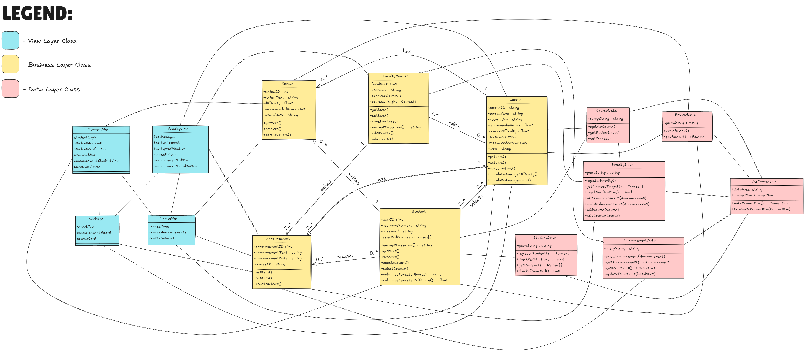
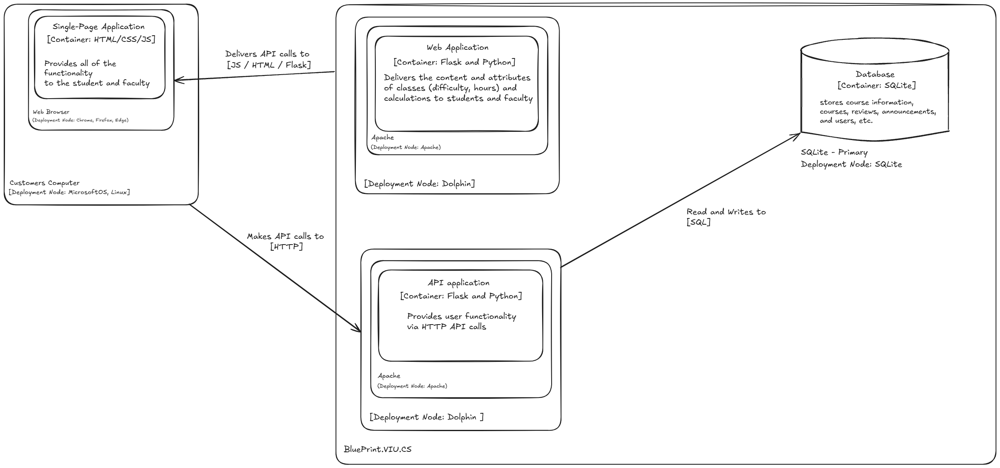

# Apache 84 - Design Models

## Document Overview

This document outlines the requirements and research for Blueprint.VIU.CS system, a course planning tool aimed at improving the experience of students and faculty through course reviewing. This document contains design diagrams such as an ER diagram, a design class diagram, and a deployment design. Additionally, we have outlined testing plans for our development which covers unit and integration testing, along with user acceptance tests and an engagement plan with our users for testing.

In our ER diagram, we show how relations in our database relate to one another. For our design class diagram, we capture each relationship from the view layer to business layer and finally the data layer. And for our architectural model we created a deployment diagram which features the various environments our system will be run on. 

Our test plan outlines high priority unit and integration tests that will be conducted during the development of our system. Our user acceptance test planning outlines important use cases to be tested and describes an engagement plan for conducting interviews with various users to get feedback on our system before our final release. 

## Updates

### Project Update

* After considering your feedback, the team has decided that a change to the course information (made by a faculty member) should automatically trigger an announcement.
* This will be a ‘stretch feature’ and will only be implemented if we have extra time at the end of our development phase.

### Project Plan Update

* New stretch feature: Automatic announcement function for faculty course changes.

### Requirements Update

Added a functional requirement relating to the moderation of reviews so that this functionality can be tested.

### Analysis Models Update

**Domain objects and class diagram changes:**
* Added a date attribute to announcements.
* Added a date attribute to reviews.
* Added year and terms attributes to courses.
* Changed the ‘text’ attributes in announcements and reviews to ‘description’ (note that they have different names in our design models)
* A course’s ‘recommended hours’ is computed as an average from all of the reviews (like difficulty)
* It is the recommended hours per week a student feels they need to allocate to this class in order to be successful.
* Updated the domain class diagram summary to be more accurate.
* Numbered and labelled all figures (including SSDs)
* Updated course to student association to be 0..* to 0..* (instead of 0..* to 1..*)
* Updated announcement to student association to be 0..* to 0..* (instead of 1..* to 0..*)


**System sequence diagram updates:**
* Added a loop block to the course selection part of the semester difficulty process diagram.
* Added an opt block to the changing course part of the announcement functionality diagram.


**Addressing feedback (no changes):**
* The number of assignments, tests, and hours of reading will and should be in the course description. We will have user guidelines for writing course descriptions that faculty can refer to.
	* We don’t plan on courses being searched by # of assignments, only by things such as year, difficulty, term, and name.
* We don’t think we need any opt or loop blocks to better show the student review process, but we did add them to the other SSDs.

## Design Diagrams

This section will include the physical ER diagram and the schema for the database of Blueprint.VIU.CS, along with the full design class diagram of the system.

### Figure 1: ER Diagram

Below is the ER Diagram for our system. Each entity represents a domain object whose attributes will be stored in our database. Additionally, any many-to-many relationships will be kept as tables in our database (described in our schema below).
* Note that faculty members and courses have multiple links between them as they are related in more than one way.

```mermaid
---
title: ER Diagram
---

erDiagram
    FacultyMember |{--o{ Course : edits-or-adds
    FacultyMember o{--o{ Course : teaches
    Announcement o{--|| Course : has
    Announcement o{--|| FacultyMember : makes
    Announcement o{--o{ Student : reacts-to
    Review o{--|| Student : writes
    Review o{--|| Course : has
    Student ||--o{ Course: selects

   FacultyMember {
       int facultyID(PK)
       string username
       string password 
   }

   Student {
       int studentID(PK)
       string username
       string password
   }

   Review {
       int reviewID(PK)
       string reviewText
       float difficulty
       int recommendHours
       date reviewDate	
       string CourseID(FK)
       int studentID(FK)
   }

   Announcement {
       int announcementID(PK)
       string announcementText
       date announcementDate
       string courseID(FK)
   }

   Course {
       string courseID(PK)
       string courseName
       string description
       float recommendedHours
       float classDifficulty
       string sections
       int recommendedYear
       string term
   }

   CoursesTaught {
       int facultyID(FK)(PK1)
       string courseID(FK)(PK2)
   }

   CourseEditHistory {
       int facultyID(FK)(PK1)
       string courseID(FK)(PK2)
       date editDate(PK3)
       changeDescription
   }

   AnnouncementReactions {
       int announcementID(FK)(PK1)
       int studentID(FK)(PK2)
       int reaction
   }
```

### Table 1: Database Schema
This table contains all of our database tables, the data types and constraints of all the data in them, and the primary and foreign keys of each table. 
* Note: Multi-column primary keys are denoted by “Primary Key (part X)”
* Additional association tables from many-to-many relationships have been added:
	* CoursesTaught - a table that tracks each faculty member account’s courses taught so they can quickly find those courses on their home page.
      * This is so faculty can add courses to their account for quick access, and we needed somewhere to store it so when they logoff and log back on their account information is saved.
	* CourseEditHistory - a table that logs when courses are edited. Faculty can leave an optional description of changes that will be turned into an automatic announcement.
      * This is incase a faculty member makes an incorrect change to a course, they can be punished!!
      * In reality, this is so faculty can check if changes they were going to make to a course were already made or not, incase they can't see it directly.
      * Also to log the data of the history of course changes to see if the same changes are being made over and over again or what changes are getting reverted, etc.
	* AnnouncementReactions - a table that tracks students and their reactions to announcements, so they can’t react more than once to an announcement.
      * Same reasoning as CoursesTaught where we want this information to be restored when students log in after logging off so they get a visual indicator of their reaction if they revisit the page.

Each table/relation has its name as the header, followed by the table columns, data types, and constraints.

#### FacultyMember
| Column Name | Data Type | Constraints |
|-------------|-------------|----------|
| facultyID   | int      | Primary Key |
| username    | string   | Not Null    |
| password    | string   | Not Null    |
#### Student 
| Column Name | Data Type | Constraints |
|-------------|-------------|----------|
| studentID   | int      | Primary Key |
| username    | string   | Not Null    |
| password    | string   | Not Null    |
#### Review 
| Column Name | Data Type | Constraints |
|-------------|-------------|----------|
| reviewID        | int      | Primary Key         |
| reviewText      | string   |                |
| difficulty      | float    | Not Null                |
| recommendHours  | int      | Not Null                |
| reviewDate      | date     | Not Null                |
| courseID        | string   | Foreign Key → Course    |
| studentID       | int      | Foreign Key → Student   |
####  Announcement 
| Column Name | Data Type | Constraints |
|-------------|-------------|----------|
| announcementID    | int      | Primary Key             |
| announcementText  | string   |                |
| announcementDate  | date     | Not Null                |
| courseID         | string   | Foreign Key → Course    |
#### Course 
| Column Name | Data Type | Constraints |
|-------------|-------------|----------|
| courseID         | string   | Primary Key |
| courseName       | string   | Not Null    |
| description      | string   |    |
| recommendedHours | float    |    |
| classDifficulty  | float    |    |
| sections        | string   |    |
| recommendedYear  | int      |   |
| term            | string   |    |
#### CoursesTaught 
| Column Name | Data Type | Constraints |
|-------------|-------------|----------|
| courseID   | string   | Foreign Key → Course, Primary Key (Part 1) |
| facultyID  | int      | Foreign Key → FacultyMember, Primary Key (Part 2) |
#### CourseEditHistory 
| Column Name | Data Type | Constraints |
|-------------|-------------|----------|
| courseID   | string   | Foreign Key → Course, Primary Key (Part 1) |
| facultyID  | int      | Foreign Key → FacultyMember, Primary Key (Part 2) |
| editDate  | date      | Primary Key (Part 3) |
| changeDescription | string      | |
#### AnnouncementReactions
| Column Name | Data Type | Constraints |
|-------------|-------------|----------|
| announcementID | int | Foreign Key → Announcement, Primary Key (Part 1) |
| studentID       | int   | Foreign Key → Student, Primary Key (Part 2) |
| reaction        | int   | |

### Figure 2: Design Class Diagram

Below is the full design class diagram for our system. Each class is colour coded based on what layer it is in (refer to the legend in the top left). 

The business layer has navigation visibility, labels, and cardinalities added to the links. It largely resembles the  from A4.

The view layer classes have components, but no specific attributes or methods as we are less familiar with the structure of web-based languages. These class cards show the modularity of our frontend structure (which components are grouped with what), rather than specific classes.

The data layer contains methods that will retrieve or write data to the database. In the case of retrieving, it will return data to the business layer. In the case of writing, it will get values from the business layer and write them to the database (not shown in the diagram).



### Architectural Design

#### Figure 3: Deployment Diagram


Our deployment diagram captures the infrastructure of our software systems and containers in the static model based on a deployment environment.  We have segmented our diagram by displaying relations to system calls done by the user and listing the environments in which these calls are made. We have our deployment node for our API calls hosted on dolphin which will be on an apache server. As well as capture how relations between the API and the database are made. 

Based on our diagram, we intend to have our system be able to be run on any device which can connect to the internet and access a browser (Chrome, Edge, Firefox). For our software we will need to use our Apache server to host our web servers and store our code base. Any manual functionality will come in the form of interacting/updating our system. There is no necessary pre instruction to use our system unless given otherwise.

Security and reliability wise, our biggest concern is not letting any personal data be potentially accessible to outside users and ensure our system is safe and unable to produce any leaks of information. We want to ensure our systems functionality and UI is both navigable and intuitive for both our user types. 

## Testing plan

The section below describes the testing plan for our system. The developer tests section will go over the most important unit and integration tests that will be conducted during development. The user acceptance tests plan will go over the most important user acceptance tests and the engagement plan to get feedback from various users of our system.

### Developer tests

#### Unit Tests
Our unit tests are broken into three parts, separated by each layer in our design class diagram. We will test each method in isolation in each layer before moving on to integration testing.

##### Table 2: Unit Tests - Database
Each function in `db_queries.py` should be tested in isolation to verify it returns the expected results. This will ensure that the system can communicate with the database by writing or retrieving data.

| Test ID | Function          | Responsible Tester | Test Description                                         | Expected Output                     | Test Frequency    |
| ------- | ----------------- | ------------------ | -------------------------------------------------------- | ----------------------------------- | ----------------- |
| UTD-1    | `execute_query()` | Christopher              | Insert data into a table and verify it commits correctly | Data should persist in the database | Before deployment |
| UTD-2    | `fetch_query()`   | Christopher             | Retrieve known records from tables                       | Expected records are returned       | Before deployment |
| UTD-3    | `fetch_query()`   | Christopher           | Query an empty table                                     | Should return an empty list         | Before deployment |

##### Table 3: Unit Tests - Frontend
These tests ensure that the frontend presents the correct information in an easily understandable and intuitive way for the user.

| Test ID | Function         | Responsible Tester | Test Description                                         | Expected Output                     | Test Frequency    |
| ------- | ----------------- | ------------------ | -------------------------------------------------------- | ----------------------------------- | ----------------- |
| UTF-1    | searchBar() | Lachlan/Casey | Search for a course by name | Relevant course cards are displayed | Before deployment/ Everytime a new searchable course is added  |
| UTF-2    | Course Card | Lachlan/Casey | Verify when a course card is viewed all elements display in correct format | course card fully displays all expected elements, there is no format change between different course cards | Before deployment/ Everytime a new course is added to system |
| UTF-3    | Review Card | Lachlan/Casey | Verify review card displays in correct format | Review Card displays in the correct format, all user-fields are interactable.  | Before deployment |
| UTF-4 | studentLogin() | Lachlan/Casey | Verify student login with correct credentials |  | Redirects to student view of site | before deployment |
| UTF-5 | facultyLogin() | Lachlan/Casey | Verify faculty login with correct credentials | Redirects to faculty view of site | Before deployment |
| UTF-6 | announcementPopulate() |Lachlan/Casey  | Fetch announcements from backend | Correct announcements are displayed | Before deployment |

##### Table 4: Unit Tests - Backend
These tests ensure that the calculations in the business layer are correct and follow the business logic of our system. It also ensures that objects are instantiated properly before communicating to the data layer.

| Test ID | Function          | Responsible Tester | Test Description                                         | Expected Output                     | Test Frequency    |
| ------- | ----------------- | ------------------ | -------------------------------------------------------- | ----------------------------------- | ----------------- |
| UTB-1    | calculateAverageDifficulty() | Lachlan/Brandon/Luka | get average difficulty from course review information  | Returns accurate calculation  | Before deployment  |
| UTB-2    | postAnnouncement() | Lachlan/Brandon/Luka | Post an announcement from faculty account | Entry is correctly added to DB and displayed on course card | Before deployment |
| UTB-3    | calculateAverageHours() | Lachlan/Brandon/Luka | get average hours from course review information | returns accurate calculation | Before deployment |
| UTB-4 | getReviewData | Lachlan/Brandon/Luka | fetch course review data form DB | Returns correct review data | Before deployment |

#### Integration Tests
We have two groups of integration tests. The database integration tests test that the data layer can receive parameters from the business layer and return data to the business layer after querying. The frontend to backend integration test ensures that the frontend communicates with the backend correctly through several use cases.

##### Table 5: Integration Tests - Database
These tests ensure that the database functions correctly when used as part of the system.

| Test ID | Component(s)      | Responsible Tester    | Test Description                                      | Expected Outcome                             | Test Frequency                |
| ------- | ----------------- | --------------------- | ----------------------------------------------------- | -------------------------------------------- | ----------------------------- |
| ITD-1    | `db_setup.py`     | Christopher/Luka  | Run `create_tables()` and check tables exist          | `.tables` command in SQLite lists all tables | After database schema changes |
| ITD-2    | `db_queries.py`   | Christopher/Luka  | Insert and fetch records to validate full interaction | Query returns expected values                | Before deployment            |
| ITD-3    | Flask Integration | Brandon/Luka | Ensure Flask app calls `fetch_query()` correctly      | API endpoints return expected data           | Before final testing          |

##### Table 6: Integration Tests - Frontend to Backend
These tests ensure that the frontend communicates with the backend correctly and efficiently when dealing with several important use cases.

| Test ID | Function          | Responsible Tester | Test Description                                         | Expected Output                     | Test Frequency    |
| ------- | ----------------- | ------------------ | -------------------------------------------------------- | ----------------------------------- | ----------------- |
| ITF-1    | studentRegister -> Data layer/module | Luka/Brandon/Christopher | Verify valid student login and connection  | Student account gets entered into database. Student object is returned to frontend. | Before Deployment |
| ITF-2    | facultyRegister -> Data layer/module | Luka/Brandon/Christopher | Verify only faculty gains access to course tools  | Faculty account goes through verification and then gets entered into database, access is granted. | Before Deployment |
| ITF-3    | FacultyMember.editCourse() -> Course and CourseData module | Luka/Brandon/Christopher | Faculty modifies a course and system pushes changes to database and shows updated ver. on frontend. | Course data is updated in DB correctly / course update appears on frontend. | Before deployment |
| ITF-4 | FacultyMember.postAnnouncement() -> Anouncement and AnnouncementData module | Luka/Brandon/Christopher |  Faculty makes announcement and system pushes changes to database and it shows up on frontend. | Announcements database table is updated and announcement appears on frontend | Before deployment |

### User Acceptance Tests Plan

#### Table 7: User Acceptance Testing Plan (UAT) Frontend

We decided to split our UAT by getting feedback on the front end section of our project and the back end/database section of our project. This was decided since our team will be have different developers doing implementations, we want to have those developerrs demonstrate each use case/functional or non-functional requirement/use case stories. Each member conducting the interview will be taking notes of any feedback given to our system.

These tests will validate that all of our essential features are correctly updating with users' interaction with the system. We prioritize having these front end features working so users are getting accurate information returned when using the system. We want to make sure our faculty users can update/edit courses effectively, and we want to make sure users are able to interact with review components and course components. 


| Requirement(s) | User ID | Date | Team member | Mode (online/in-person) |
| --- | --- | --- | --- | --- |
| Requirement(s)             | User ID | Date | Team Member | Mode (Online/In-Person) |
| -------------------------- | ------- | ---- | ----------- | ----------------------- |
| Course Updates     | U001    | April 3rd, 2025 | Casey   | In-Person                      |
| Semester Calculator     | U001    | April 3rd, 2025 | Casey   | In-Person                      |
| Course Editor     | U001    | April 3rd, 2025 | Casey   | In-Person                      |
| Review Updates    | U002   | April 3rd, 2025  | Lachlan | In-Person                              |
| View Courses | U003    | April 2nd, 2025  | Casey | In-Person                                 |
| Filter Courses | U003    | April 2nd, 2025  | Casey | In-Person                                 |
| View Announcements            | U004    | April 2nd, 2025  | Luka         | In-Person                 |


#### Table 8: User Acceptance Tests (UAT) Database/Backend

These tests validate if the database supports the functional needs of users. These functions will need to be working before the final showing of our product and will a  priority for implementation. We want to ensure that when calls are made by users that these components in our system are accurately being updated and returning proper values. 

| Requirement(s)             | User ID | Date | Team Member | Mode (Online/In-Person) |
| -------------------------- | ------- | ---- | ----------- | ----------------------- |
| Course Review System       | U001    | April 3rd, 2025 | Casey   | In-Person        |
| Faculty Announcements   | U002   | April 3rd, 2025  | Lachlan | In-Person           |
| Student Account Management | U003    | April 2nd, 2025  | Casey | In-Person         |
| Course Listings            | U004    | April 2nd, 2025  | Luka         | In-Person  |
